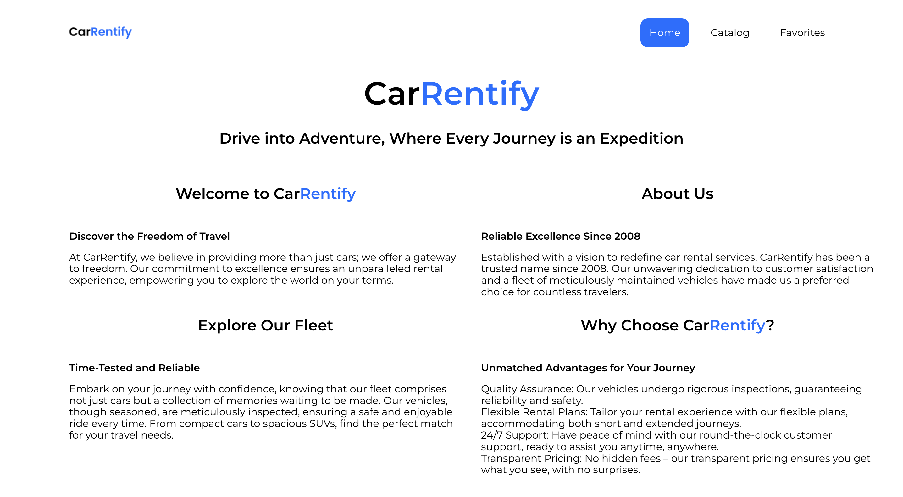
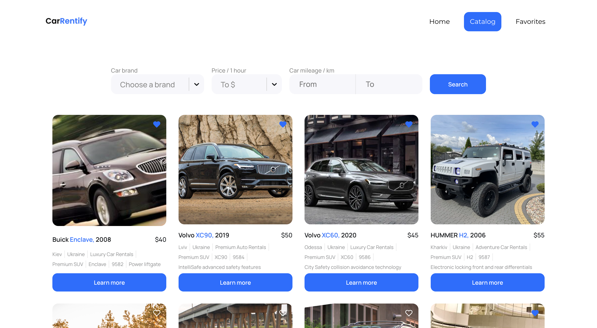
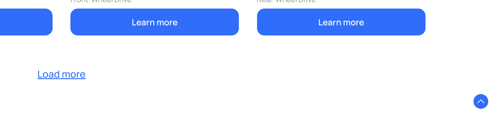
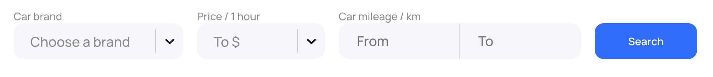
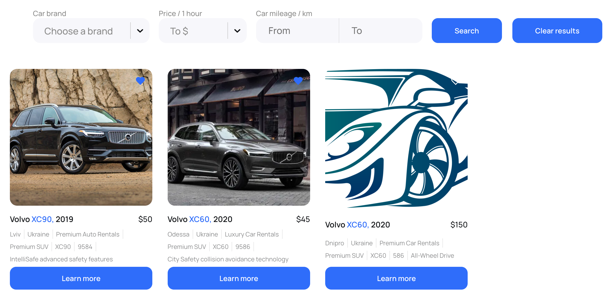
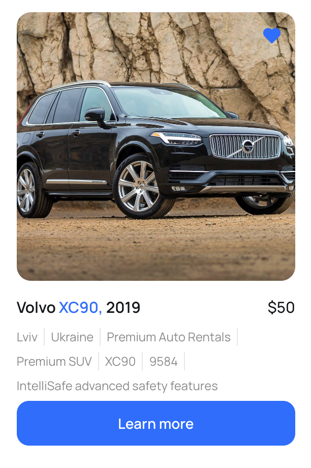
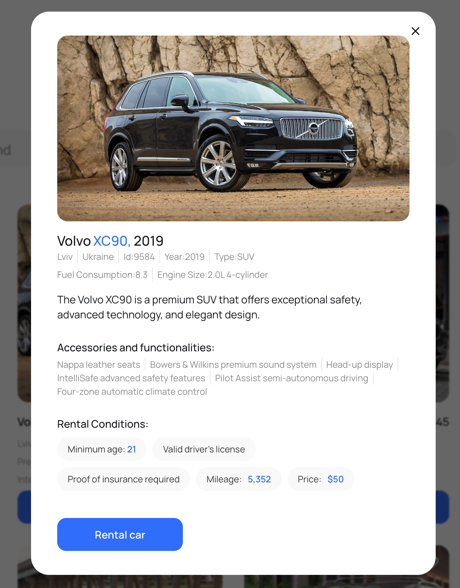
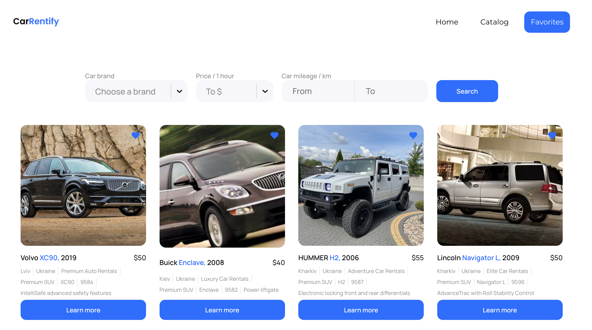
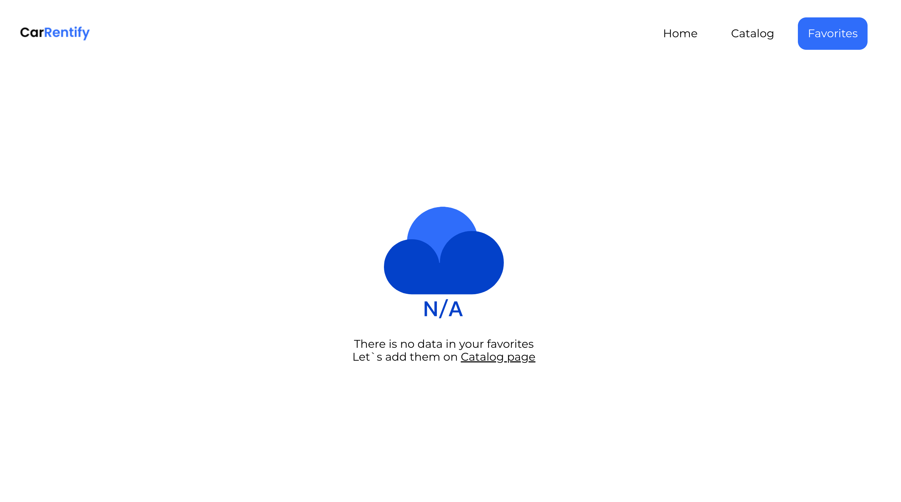

# CarRentify

---

[**CarRentify**](http://car-rentify.vercel.app) is a user-friendly web application for car rentals. Users can effortlessly explore available cars in the database by filtering based on the car's make, hourly rental cost, and mileage. The application streamlines the car rental process, offering an intuitive interface for efficiently finding and selecting the desired vehicle.

Additionally, the app features a dedicated 'Favorites' page where users can conveniently view all cars marked as favorites.
This personalized section allows users to keep track of and manage their preferred vehicles, providing a seamless experience for those who wish to monitor and access a curated list of their favorite rental options.

---

#### Home page

On the home page, the user can familiarize himself with the company's activities.

#### Catalog page

On the Catalog page, the user has the opportunity to familiarize himself with the 12 starting cards of the offered cars, can load the next 12, etc., using the "Load more" button.
Additionally, a soft scroll button to the top of the page is implemented. It is also possible to use the search form, which has 4 parameters. The search is performed on all data located on the backend

After using the search, a button to clear the results becomes available to the user. When the user clicks, he will be returned to the beginning of the Catalog page

On the card there is a button to add a car to favorites, which changes its color when clicked. Also, by clicking on the Learn more button, a modal window will open to the user with complete information about the car.

#### Favorites page

On the Favorites page, the user gets access to cars that have been added to favorites. If there are no such cars, a message will be displayed.

The search form here works differently than on the Catalog page. Here, the search takes place only on the list of selected cars.

---

Adaptive layout for breakpoints is also implemented (375px, 768px, 1280px)

---

Used technologies:

- HTML
- CSS
- React/Redux Toolkit
- React Router Dom
- React Hook Form
- React Select
- React Responsive
- React Toastify
- Framer Motion
- Styled Components

Backend:

- https://mockapi.io/

Bundler:

- Vite
